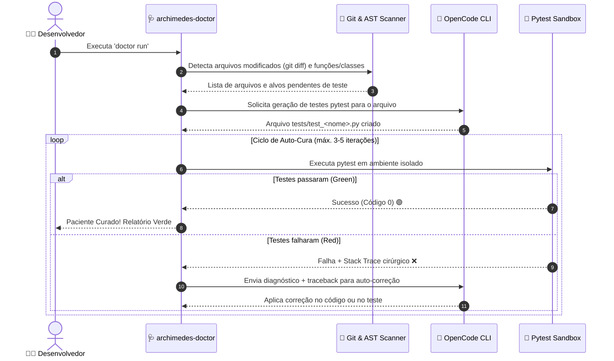

# 🩺 Archimedes Doctor — Gerador Autônomo de Testes com Self-Healing

> Gerador de testes unitários (`pytest`) com loop autônomo de auto-correção (*Self-Healing*). Analisa arquivos modificados via Git, extrai funções sem cobertura via AST, gera testes com o OpenCode e itera sobre o *stack trace* em ambiente isolado até os testes ficarem 100% verdes.

---

## 🎯 Como Funciona o Ciclo de Auto-Cura (Self-Healing)



---

## ⚡ Principais Recursos

- 🌿 **Foco Cirúrgico em Modificações (Git Diff)**: Não perde tempo retestando o repositório inteiro; diagnostica apenas os arquivos alterados recentemente.
- 🌳 **Análise Sintática por AST**: Identifica funções síncronas, assíncronas e classes que ainda não possuem funções de teste correspondentes.
- 🩺 **Loop de Auto-Cura (Self-Healing)**: Se o teste quebrar, o `archimedes-doctor` isola o erro, captura o *stack trace* e instrui o OpenCode a corrigir a falha (seja no teste ou na implementação).
- 🛡️ **Execução Híbrida (Sandbox Local + Docker)**: Roda nativamente em subprocesso isolado com controle de `PYTHONPATH` e timeout de segurança contra loops infinitos, com suporte opcional a Docker container (`--docker`).
- 📊 **Relatórios Ricos com Rich**: Painéis de progresso, status visual de cada paciente e tabela final de cura.

---

## 🚀 Instalação e Configuração

### 1. Pré-requisitos
- Linux / macOS com Python 3.10+
- Binário do [`opencode`](https://opencode.ai) instalado no sistema

### 2. Configurar o Ambiente Local
```bash
cd ~/projetos/archimedes-doctor

python3 -m venv .venv
.venv/bin/pip install -r requirements.txt
```

### 3. Atalhos no Terminal (`~/.local/bin`)
Os wrappers executáveis já vêm configurados:
```bash
ln -sf ~/projetos/archimedes-doctor/bin/archimedes-doctor ~/.local/bin/archimedes-doctor
ln -sf ~/projetos/archimedes-doctor/bin/doctor ~/.local/bin/doctor
```

---

## 💻 Como Usar

### 1. Curar e Testar Arquivos Modificados no Git
Basta rodar na raiz de qualquer projeto com repositório Git:
```bash
doctor run
```

### 2. Focar em um Arquivo Específico
```bash
doctor run src/modulo_critico.py --max-retries 4
```

### 3. Varredura Rápida sem Executar Testes (`scan`)
Para inspecionar quais arquivos modificados possuem funções que precisam de cobertura:
```bash
doctor scan
```

### 4. Diagnóstico de Ambiente (`info`)
Verifica se o Docker está disponível ou se o Sandbox Local será utilizado:
```bash
doctor info
```

---

## 🧪 Testes Automatizados do Próprio Projeto

```bash
PYTHONPATH=. .venv/bin/pytest -v tests/
```

---

## 🏛️ Filosofia Archimedes
Desenvolvido como parte do ecossistema de ferramentas de engenharia de software do **Archimedes Vault**.
Totalmente integrado com busca semântica local via `archimedes-rag`.
